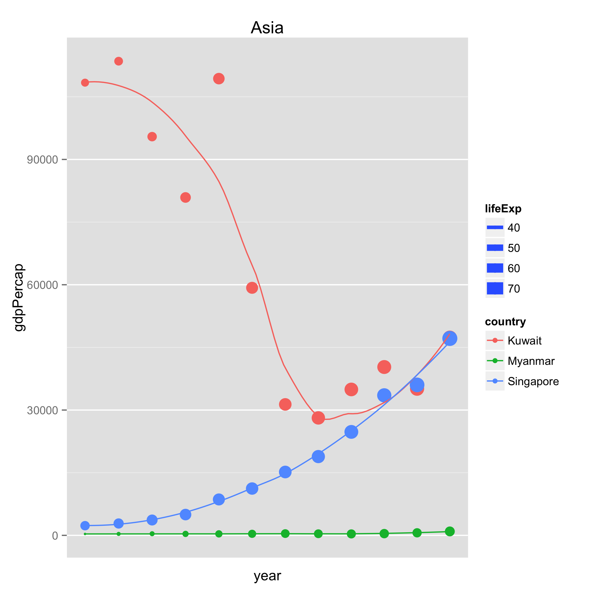

# report_HW09
Poushali  
27 November 2015  

The pipeline works as follows: 

1) Download data using **download.R** script and save as gapminder.tsv

2) Use gapminder.tsv and **analysis.R** to analyse and explore the data. I reorder continents on basis of standard deviation of gdp per capita, excluding Oceania which has only 2 countries. 

I filter observations that show minimum/maximum gdp per capita for each continent, for a year. I keep only these country levels and write the new dataset to file as gap_data_clean.tsv. Here's the corresponding plot:

3) Using gap_data_clean.tsv and **stats.R** I plot the linear regression function for life expectancy vs. gdp per capita for each country (for the selected country and continent levels), filter the results for each continent which show the lowest standard deviation of residual (lowest 3) and write the filtered results to file as linfit_filtered.tsv

4) Next I use linfit_filtered.tsv, gap_data_clean.tsv and **plots.R** to plot the change in gdp per capita with time for each continent, also showing life expectancy for each country and year, and save the plots to file. Here's an example plot for Asia. 

5) I finally use the **Makefile** so that the entire process is automated. 

